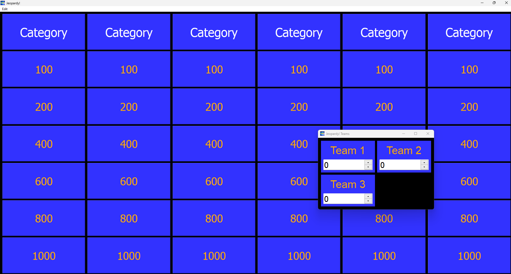
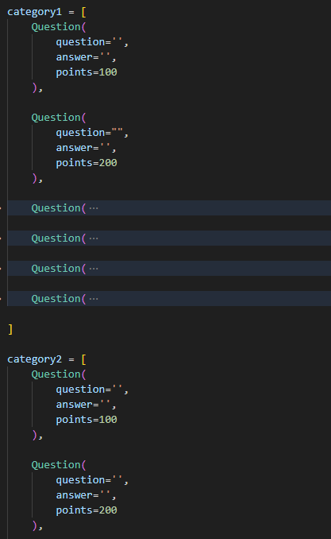
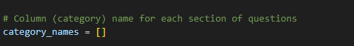

# Jeopardy!

## Welcome to the classic Jeopardy game!

This game runs using Python with PyQt5 module for the gui.

Download PyQt5 https://pypi.org/project/PyQt5/

___

To create question prior to starting game, open "questions.py" in the Program_files folder. 
Each column (category) is group as lists, where the points increase respectivitely.

___

To label each column, write each name as a string in the category_names list:

